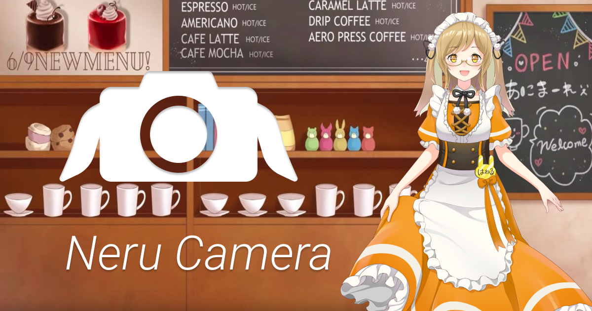

  <a class="product" href="https://neru.camera/" rel="noreferrer noopener" target="_blank">
    
    

      <h2 class="product__name">ねるカメラ</h2>
      
因幡はねるさんと一緒に写真が撮れるアプリです。ねるちゃんとの幸せなひとときをあなたに。

    

  </a>
  <a class="product" href="https://shindan.animare.cafe/" rel="noreferrer noopener" target="_blank">
    
    

      <h2 class="product__name">あなたのオタクタイプ診断 by あにまーれ</h2>
      
好みと推しVTuberを無意識から探るためのアプリです。アナタはどんなオタクタイプ?

    

  </a>
  <a class="product" href="https://heartbeat.haneru.dev/" rel="noreferrer noopener" target="_blank">
    
    

      <h2 class="product__name">heartbeat!</h2>
      
因幡はねるさんの鼓動を感じるためのアプリです。因幡はねるさんの鼓動を感じて、因幡はねるさんに包まれて眠りましょう。

    

  </a>

## Haneru Developers とは?

Haneru Developers はバーチャル YouTuber の[因幡はねるさん](https://www.youtube.com/channel/UC0Owc36U9lOyi9Gx9Ic-4qg)をテーマとしたアプリやサービスの開発を主として行うコミュニティーです。
